# Document Axepta BNP Paribas Prestashop

Objectif du document :
Regrouper tous les éléments relatifs à la refonte du module pour l’installation et l’utilisation du module.

## SOMMAIRE

- [Document Axepta BNP Paribas Prestashop](#document-axepta-bnp-paribas-prestashop)
  - [SOMMAIRE](#sommaire)
  - [INTRODUCTION](#introduction)
    - [PREREQUIS NECESSAIRES](#prerequis-necessaires)
    - [INSTALLATION DU MODULE](#installation-du-module)
    - [MISE A JOUR DU MODULE](#mise-a-jour-du-module)
  - [BACK OFFICE](#back-office)
    - [CONFIGURATION GLOBALE DU MODULE](#configuration-globale-du-module)
      - [CONFIGURATION DU COMPTE](#configuration-du-compte)
      - [CONFIGURATION DU PAIEMENT](#configuration-du-paiement)
      - [METHODE DE CAPTURE](#methode-de-capture)
      - [METHODES DE PAIEMENT](#methodes-de-paiement)
      - [PERSONNALISATION](#personnalisation)
    - [TABLEAU DES COMMANDES](#tableau-des-commandes)
      - [CAPTURE MANUELLE](#capture-manuelle)
    - [LOGS](#logs)
    - [REMBOURSEMENT / ANNULATION](#remboursement--annulation)
    - [LISTE DES TRANSACTIONS](#liste-des-transactions)
  - [FRONT OFFICE](#front-office)
    - [ESPACE CLIENT](#espace-client)

## INTRODUCTION
AXEPTA BNP Paribas vous donne accès à plusieurs moyens de paiement. Chacun d'entre eux propose une solution de paiement en ligne pour les e-commerçants.
Ces moyens de paiement couvrent actuellement le paiement simple.
Une librairie couvre les fonctions communes aux modules pour l’envoi des données vers 
### PREREQUIS NECESSAIRES
Les versions PHP compatibles avec le module sont les suivantes :
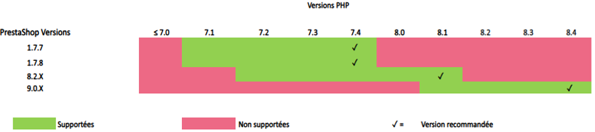
### INSTALLATION DU MODULE
L'installation du module se déroule de la manière suivante :

<ol>
  <li>Télécharger le zip du module ensuite le dézipper</li>
  <li>
  Allez sur l'onglet "Modules" du backoffice de votre boutique (à gauche de l'écran) > "Catalogue du module" , cliquez sur « Installer un module » puis télécharger le fichier zip du module (en le glissant dans la zone correspondante).

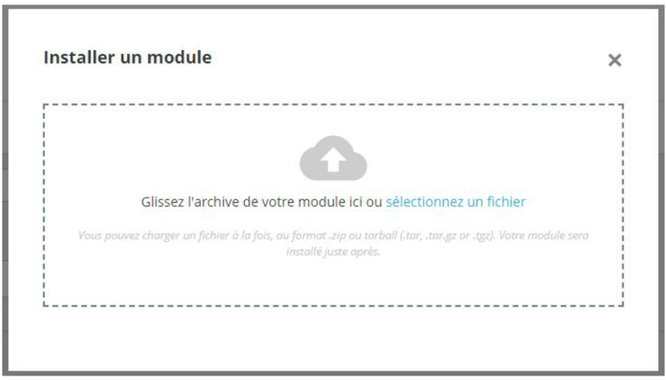
  
  </li>
  <li>
    Dans l'onglet "Module Manager" du même menu, faites une recherche “Axepta”, et retrouver le plugin Axepta BNP Paribas.

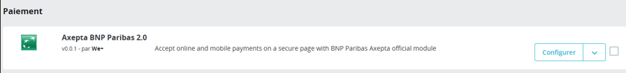
  </li>

  <li>
    Cliquez sur le bouton « Configurer » pour commencer le paramétrage. 
    Cette page de configuration vous permet de configurer les paramètres génériques de la boutique, notamment si celle-ci est “multiboutique”.
    En multiboutique, pensez à vous positionner sur la boutique dont vous avez besoin de faire un paramétrage spécifique.  
  </li>
</ol>

### MISE A JOUR DU MODULE
<ol>
    <li>Télécharger la nouvelle archive zip</li>
    <li>Mettez votre boutique en maintenance</li>
    <li>Allez sur l'onglet "Modules" du backoffice de votre boutique (à gauche de l'écran) > "Catalogue du module" , cliquez sur « Installer un module » puis télécharger le fichier zip comme pour l’installation</li>
    <li>Pensez à activer le module qui a du être désactivé</li>
</ol>

> N.B: La libraire est automatiquement mise à jour avec la mise à jour du module Prestashop

## BACK OFFICE
Pensez par la suite à remettre les paramètres de configuration Axepta Online  dans chaque onglet du module. Il faudra remettre à nouveau votre MID, votre clé d’activation pour remettre en production votre module
### CONFIGURATION GLOBALE DU MODULE
Les différentes fonctionnalités de l'outil sont disponibles sur le menu à gauche de la page. Pour commencer la configuration du module, il faut cliquer sur "AXEPTA".
La page de paramétrage fait apparaître plusieurs boutons sur le haut.

-	Contacter l’assistance : Ouverture d’un formulaire pour l’envoi d’un mail vers l’assistance. Dans le mail les versions serveur, cms et module sont automatiquement envoyées
-	Documentation : lors du clic, l’utilisateur est renvoyé vers la documentation officielle hébergée par BNP Paribas
-	Vérifier votre configuration : Permet d’afficher et de vérifier dans une fenêtre que la configuration du serveur est compatible avec le module installé.
-	Télécharger le fichier LOG : Permet de télécharger le fichier des logs liés à l’utilisation du module.

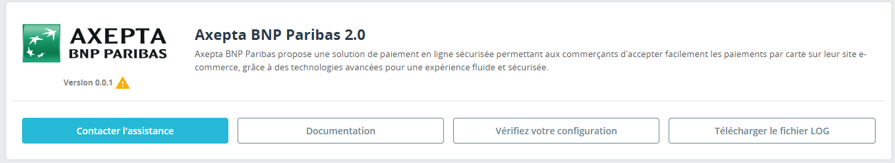

#### CONFIGURATION DU COMPTE
La configuration du mode production et du mode test sont à faire pour activer le paiement en ligne. 
Le mode démonstration ("DEMO") permet de tester le module sans paramétrage d’un MID
En mode Production, il est nécessaire de renseigner le MID et la clé privée.
En mode test , il est nécessaire de renseigner uniquement la clé privée. On utilise le MID de production auquel il a été ajouté un paramètre (_t)

Sélectionnez le mode que vous souhaitez paramétrer pour voir apparaître les champs adéquats

Pour pouvoir utiliser le module il est nécessaire de renseigner les paramètres suivants dans le formulaire

<ol>
<li>
<u>Mode production :</u>
<ul>
    <li><b>MID</b> (envoyé par BNP Paribas)</li>
    <li>
        <b>Clé privée</b> (envoyée par BNP Paribas). Elle n’est jamais affiché pour des raisons de sécurité
    </li>
</ul>
</li>

<li>
<u>Mode test :</u>

Le MID de production est utilisé par défaut avec l’ajout d’une chaine de caractère
<ul>
    <li>
        <b>Clé privée</b> (envoyée par BNP Paribas). Elle n’est jamais affiché pour des raisons de sécurité
    </li>
</ul>
<ul>
</ul>
</li>

<li>
<u>Mode Démonstration :</u>

Ce mode permet l’affichage de bandeau sur le site pour informer 
Un MID spécifique est pré paramétré

</li>

<li>
<u>Activation en front</u>

Nécessaire pour afficher le module sur la page de checkout quelque soit le mode activé
</li>

</ul>

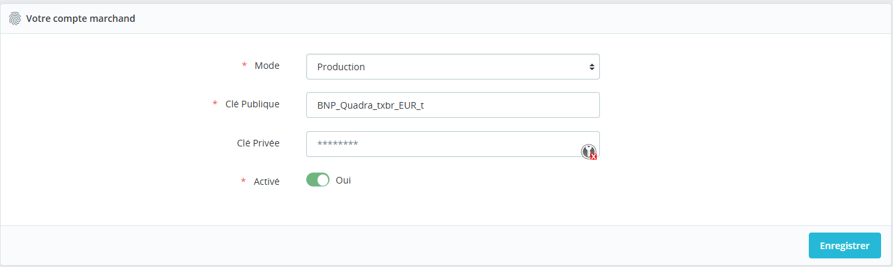
Les éléments ne sont sauvegardé que lorsque l’utilisateur clique sur le bouton de sauvegarde. Un bandeau vert apparaît si c’est correctement enregistré

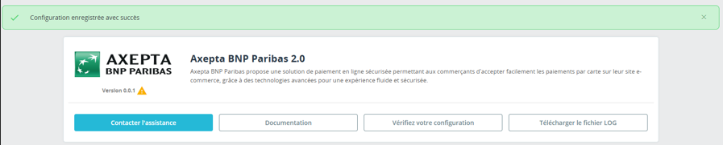

> Dans la cas contraire, le message d’erreur apparaît en rouge

#### CONFIGURATION DU PAIEMENT
Vous pouvez maintenant choisir les différents moyens de paiement à activer sur votre boutique.
Un bloc  “Configuration du paiement” permet de paramétrer l’affichage des moyens de paiement sur la page de checkout ainsi 

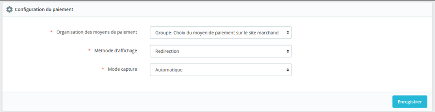

Tous les moyens de paiement intégrés à la librairie sont présentés ici. Il appartient au marchand de sélectionner les moyens de paiement qui l’a souscrit. 
La clé d’activation ne permet plus de définir les moyens de paiement.

<ul>
  <li>
    <strong>Organisation des paiements</strong> - Affichage des paiements décidé sur le checkout
    <ul>
      <li><strong>Regroupé</strong> : Les blocs de paiement apparaissent. Il est possible de paramétrer les paiements en redirection et en iframe</li>
      <li><strong>HPP</strong> : Seule la redirection est possible avec tous les moyens de paiement regroupés en un seul bouton. Affichage d'un bloc complet sans différenciation entre les cartes et les autres méthodes de paiement</li>
    </ul>
  </li>
  <li>
    <strong>Méthode d'affichage</strong>
    <ul>
      <li><strong>Redirection</strong> : Lors de la phase de paiement, l'utilisateur est renvoyé vers une page en fonction du moyen de paiement sélectionné</li>
      <li><strong>Iframe</strong> : Lors de la phase de paiement, le formulaire est affiché en bas de la page de checkout en fonction du moyen de paiement sélectionné</li>
    </ul>
  </li>
  <li>
    <strong>Méthode de capture</strong> - Cette option vous permet de choisir la méthode de capture du paiement
    <ul>
      <li><strong>Automatique (J)</strong> : La capture se fera automatiquement à minuit</li>
      <li><strong>Différée (J+x)</strong> : Vous pouvez choisir le délai avant la capture (délai en heures : nombre entier compris entre 1 et 696. Exemple pour 2 jours : saisissez 48)</li>
      <li><strong>Capture Manuelle</strong></li>
    </ul>
  </li>
</ul>

#### METHODE DE CAPTURE

<ul>
  <li>
    <strong>Méthode de capture</strong> - Cette option vous permet de choisir la méthode de capture du paiement :
    <ul>
      <li><strong>Automatique (J)</strong> : La capture se fera automatiquement à minuit</li>
      <li><strong>Différée (J+x)</strong> : Vous pouvez choisir le délai avant la capture (délai en heures : nombre entier compris entre 1 et 696. Exemple pour 2 jours : saisissez 48)</li>
      <li><strong>Capture Manuelle</strong></li>
    </ul>
  </li>
</ul>

**Activation de la capture Automatique :**

Lors de la sélection capture automatique, les flux de paiement sont automatiquement

**Activation de la capture Différée :**

La capture différée est paramétrée avec un nombre d’heure avant la capture à réaliser. Le maximum possible est 696 heures.
> NB : Aucune action n’est nécessaire par le marchand pour réalisée la capture. Elle est confirmée par un flux retour (IPN)

**Activation de la capture Manuelle :**

Dans le menu de configuration du marchand, descendre jusqu’au champ « Capture » et sélectionner « Manual Capture ».

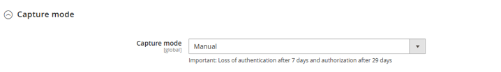

> **Attention** : Sans action du commerçant, la transaction ne sera pas remise en banque. La capture d’une transaction au-delà du 7ème jour entraîne la perte de garantie associée au 3DSecure. Au-delà du 29ème jour l’autorisation accordée par l’émetteur ne sera plus valide. Il est donc préférable de capturer les opérations avant ces échéances.

#### METHODES DE PAIEMENT
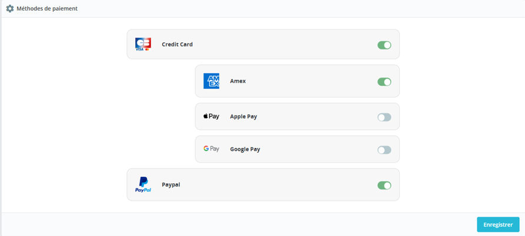

Ce bloc permet l’activation des différents moyens de paiement par carte ou Wallet :

Sélectionner les moyens de paiement à afficher en checkout.
Si CB- Visa-MasterCard est activé, le logo CB apparaîtra seulement si le pays de livraison de la commande est la France

Les paramètres Apple Pay et Google Pay permettent d’afficher les logo sur la page de checkout mais nécessitent d’avoir souscrit l’option sur le contrat pour voir l’affichage en page de paiement.

Paypal est un Wallet qui doit être paramétré en amont sur votre compte Axepta. Il est nécessaire de communiquer le PayerID de Paypal à Axepta en amont.

#### PERSONNALISATION
Permet le paramétrage des champs envoyés dans le formulaire de paiement lors de la redirection.

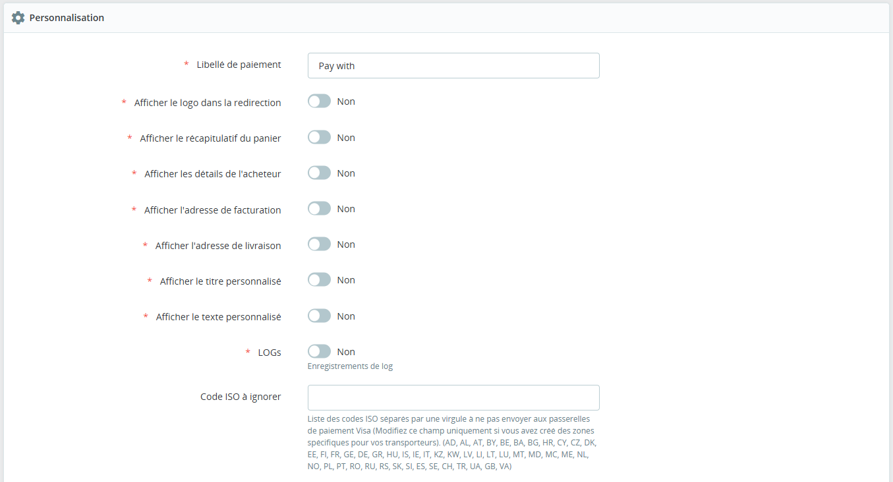

> Les codes ISO à ignorer représentent les code ISO pays si vous avez modifié le paramétrage de vos pays pour les transporteurs. Ex : FR n’est pas à envoyer car en Europe. US est à envoyer.

### TABLEAU DES COMMANDES
Des états de commandes ont été ajoutés pour vous permettre de visualiser les paiements en test, en démo ou en production

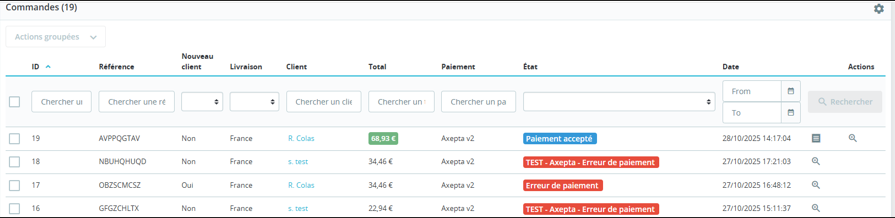

> Notez bien que les  paiement fait en démo nécessite d’être en mode Démo pour être visibles

#### CAPTURE MANUELLE

**Capturer Manuellement la transaction**

Pour capturer manuellement un paiement, il faut aller dans la liste des transactions et de cliquer sur l’icone de capture dans la colonne action

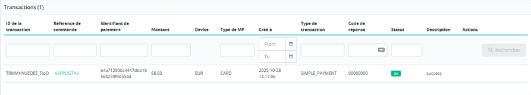

### LOGS
Les logs sont constamment activés. Il est possible de les télécharger par le bouton en haut de l’écran de paramétrage

### REMBOURSEMENT / ANNULATION
Pour rembourser une transaction, vous devez ,dans un premier temps, choisir la boutique dans laquelle la commande a eu lieu (en haut à droite de l'écran); Un remboursement ne peut être effectué que sur une boutique unique.

<ol>
<li>
Rendez vous ensuite sur la commande du client dans le détail de la transaction (comme indiqué précédemment) et cliquez sur “Remboursement partiel” dans l'onglet "commande" 

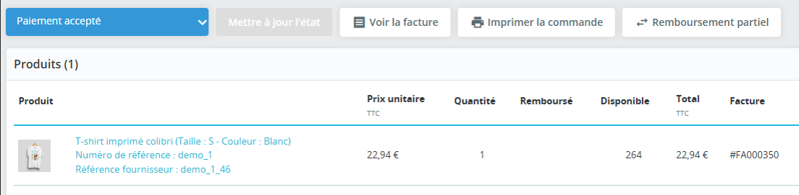

</li>
<li>
Vous serez redirigés vers l'onglet "produit" de la même page.
</li>
<li>
Choisissez le montant à rembourser (total ou partiel). Le montant ne peut pas être supérieur au montant total et la quantité ne doit pas dépasser la quantité indiquée également.
</li>
<li>
Enfin, cliquez sur “Remboursement partiel” :</li>
<li>
Une fois le montant enregistré, toujours sur le détail de la commande, vous devez aller à nouveau sur le détail du produit :

<ol>
<li>Sélectionnez la transaction qui doit être remboursée</li>
<li>Sélectionnez un bon d’achat</li>
<li>Cliquez sur “Rembourser”</li>
</ol>
</li>
<li>Vous pouvez renseigner un montant partiel si nécessaire.</li>
<li>Le produit apparaît désormais sur le détail de la commande comme <b>“remboursé”</b></li>
</ol>

**Remboursement total**

Il est possible de faire plusieurs remboursements partiels. Cependant, la somme des remboursements partiels ne peut dépasser le montant total de la commande.

**Annulation**

Si la transaction n'a pas encore été remise en banque (capturée), une annulation est possible.

### LISTE DES TRANSACTIONS
Toutes les transactions réalisées avec le modules Prestashop Axepta BNP Paribas 2.0 sont regroupées dans un tableau présent

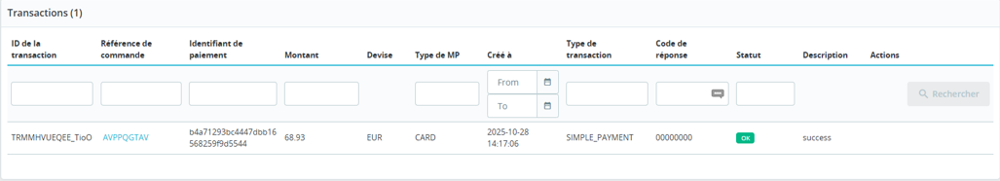

> NB : La désinstallation et la réinstallation du module provoque la purge de es transactions.

## FRONT OFFICE

**Rendu sur la page de checkout**

Les moyens de paiement sont affichés sur un cadre prévu par bloc. 
Les moyens de paiement supplémentaires sont accessibles en sélectionnant "Plus d'options de paiement", qui n’apparaît que le cas échéant. 

**Rendu de la page de paiement en redirection**

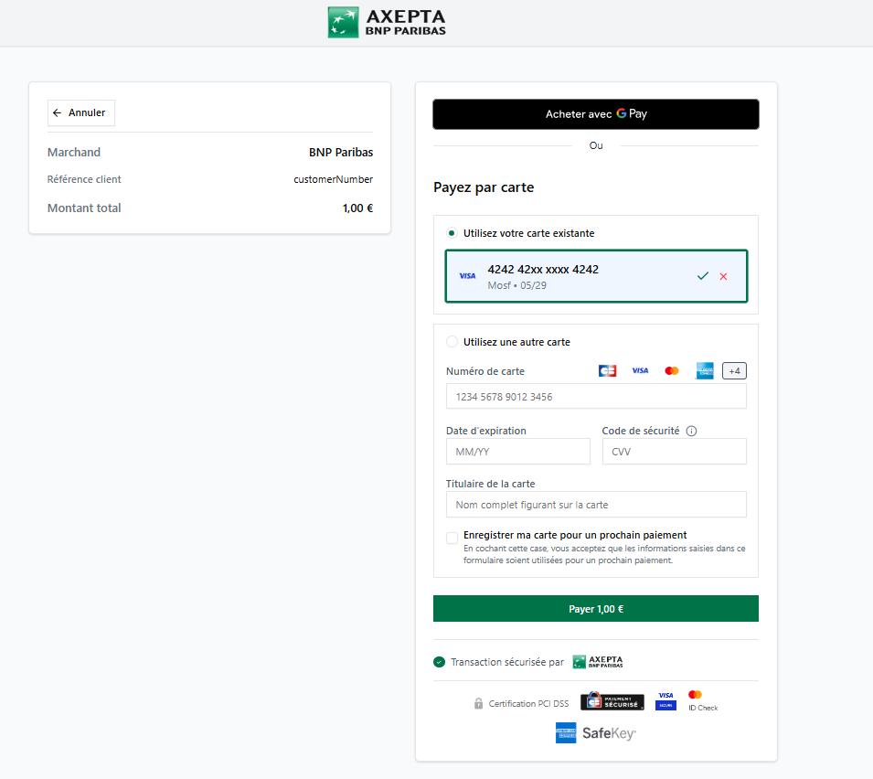

**Rendu de la page de paiement en iFrame**

En affichage iFrame, un message est afficher pour demander à l’utilisateur de ne pas rafraichir la page au risque de perdre des éléments de session. 

> Note : En mode démonstration, un bandeau Orange apparaît avec la mention "DEMO"

### ESPACE CLIENT
Les commandes affichent un bloc Axepta sur l’espace client.
